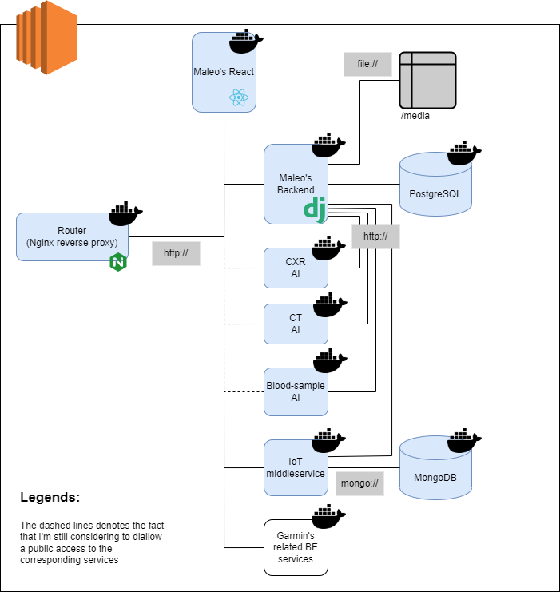

# Numed Web App: Containerized

## Description 

The idea of this project is to containerize all services in order to:

1. be able to deploy the app with a single command,
2. avoid the dependency conflict, and
3. be able to pinpoint which service is faulty in the case the app doesn't run properly.

Therefore, the proposed architecture is depicted as the figure below. 
We will have 10 services as illustrated as squares in the figure below.
The Nginx service will act as the reverse proxy to direct client-side traffics to the appropriate services.
A few services can directly connect to storage resources, e.g., filesystem or databases.
Also, among them can actually reach out to each other. (That is, lines between services show actual connections between them.)
Finally, the plan is to deploy all these services inside a virtual private server (VPS), such as an EC2 instance.




## Requirements

1. Docker version 20.10.17, build 100c701
2. docker-compose version 1.29.2, build 5becea4c
3. GNU bash, version 5.0.17(1)-release
4. Ubuntu 20.04.4 LTS (Focal Fossa)

Violating the requirement as listed above won't guarantee that your app can't run. 
It's just that I heavily tested the app by having the environment as listed above.

## Preparation

Note that this is not the only way.

Basically, as our application supports authentication and authorization services, we need to enable TLS/SSL to have HTTPS. 
But, a VPS that we use later will have a dynamic domain name. 
Therefore, we need to find an easy way to enable HTTPS for such dynamic system.
One way is to use the [Caddy server](https://caddyserver.com/).

1. Don't forget to open ports 80 and 443.

2. Install a Caddy server, a Docker engine, and a Docker Compose

    Use the script from my repo [here](https://github.com/ardimasp/ec2-user-data-caddy-docker/blob/main/installation.sh) as the user data when creating an EC2 instance.

3. Once you can gain access to the EC2 instance, make sure the following.

    a. A Caddy service is running

        
        sudo systemctl status caddy
        

    b. A Docker engine is running

        
        sudo systemctl status docker
        

    c. A Docker Compose is installed

        
        sudo docker-compose --version
        

4. Change the Caddy configuration by modifying the string ':80' in the /etc/caddy/Caddyfile with the domain name of the EC2 instance. Then, try to restart the Caddy service and access the server by using the domain name. (Note that the registration process so that we have a valid certificate takes a few minutes.)

5. If you can access the default Caddy landing page with https enabled, then you can setup a reverse proxy by using the Caddy server. You can do it by uncommenting the line with the 'reverse_proxy' command and change it to:

    ```
    reverse_proxy localhost:8000
    ```

    Remember it is 8000, not 8080

5. Lastly, don't forget to clone this repo. 

    ```
    git clone git@gitlab.com:numed/numed-containerized.git
    ```


## Installation

Go to the numed-containerized directory and run the following command

```
bash ./install.sh -s <domain-name> -p 8000 -m https
```

And, press 'Y' for a fresh installation.


Once it's all done (downloaded, installed, and run), please check if all services are up by runningL

```
sudo docker-compose ps
```

Then, try to access the web app from your browser.


## To do

TBD


